## - [Home](/README.md)
# 1.2 Soluções Existentes

## Meditação e Mindfulness

*Aplicativo especializado em meditação guiada e práticas de mindfulness*

    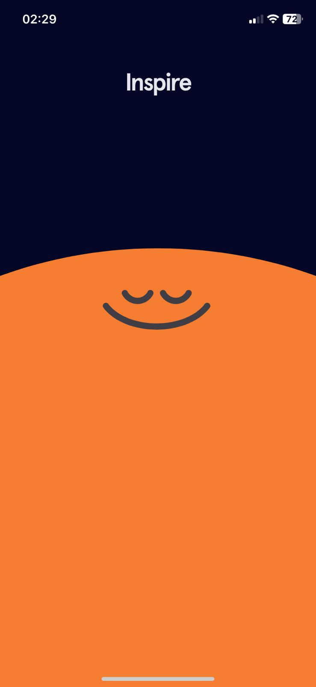
    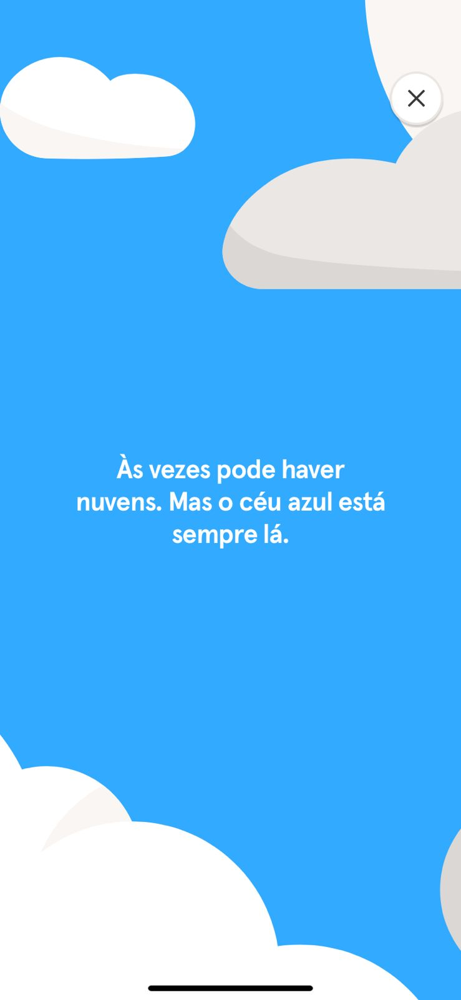
    
    
    

 

---

*Plataforma completa para relaxamento, sono e meditação*

    
    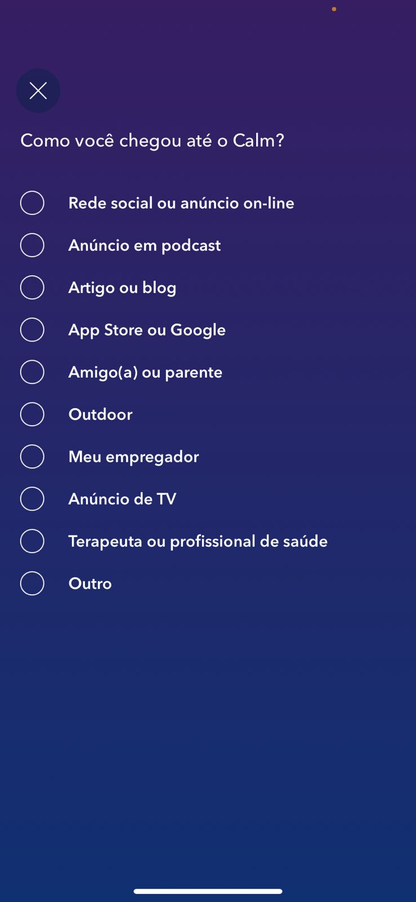
    
    

 

## Respiração e Rotina

*Aplicativo focado em técnicas de respiração para bem-estar*

    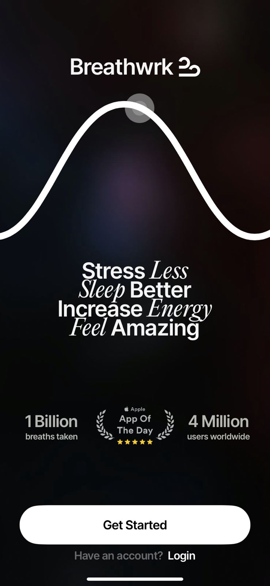
    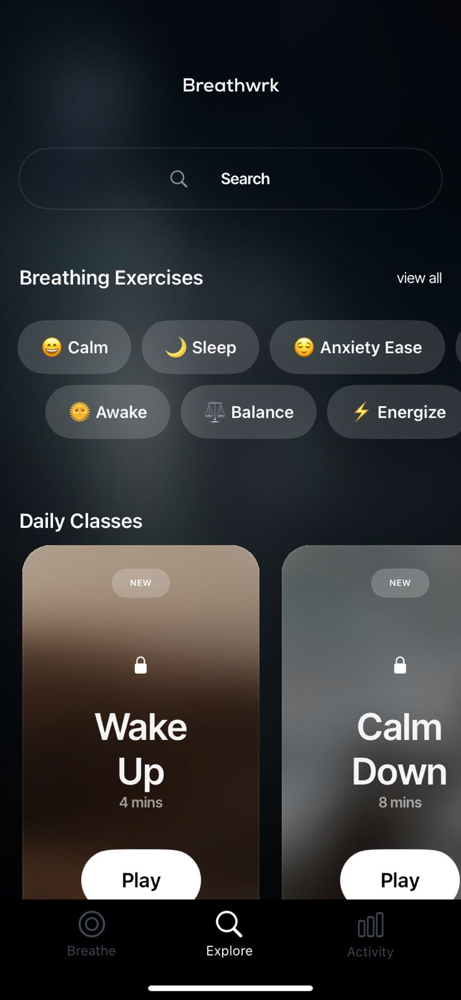
    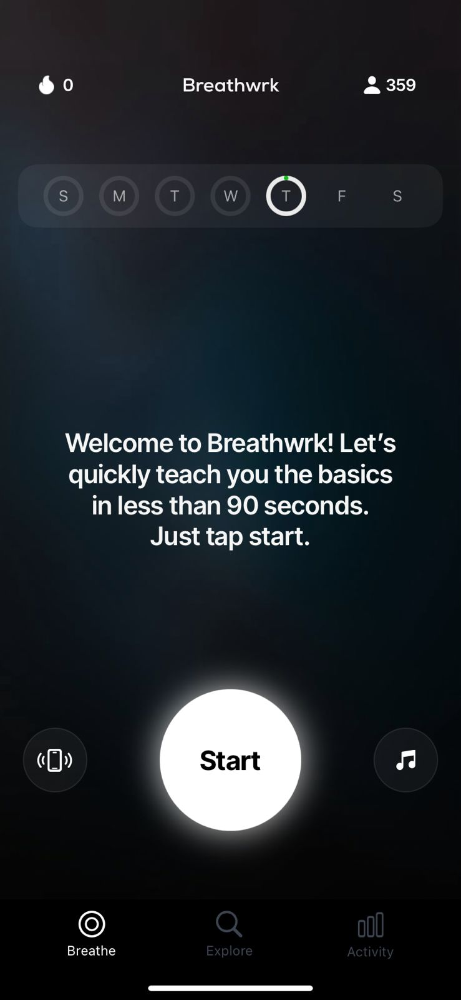
    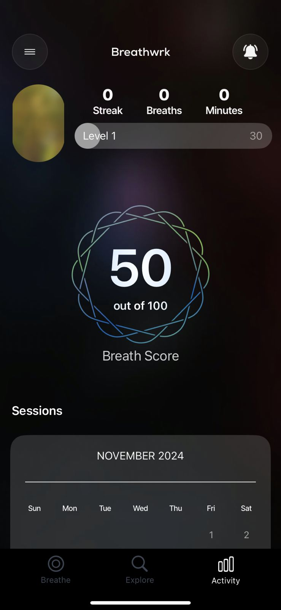

 

## Organização e Planejamento

### Todoist

*Ferramenta de produtividade para organização de tarefas e compromissos*

    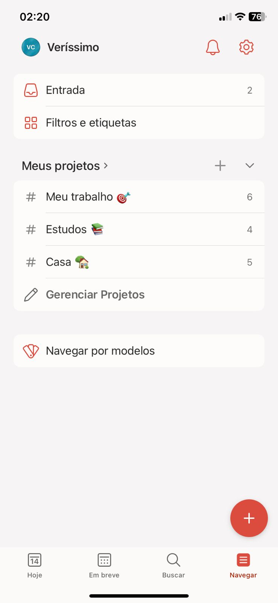
    
    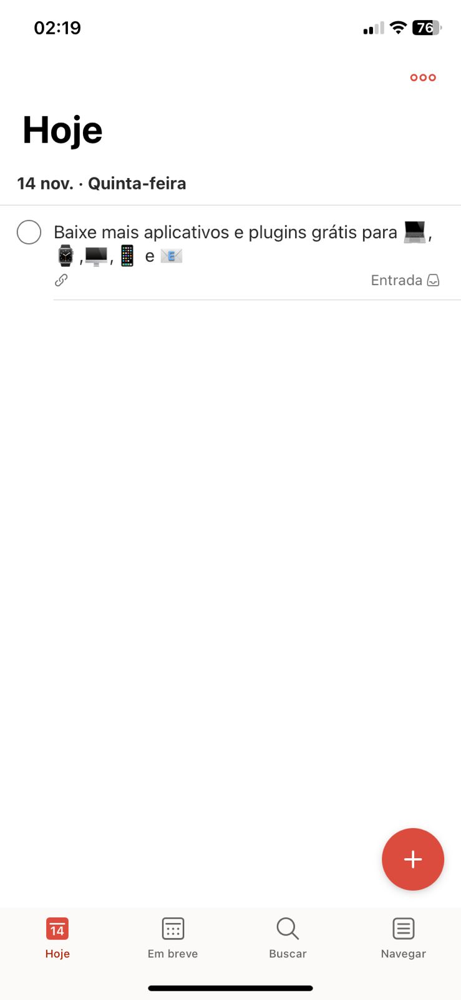

 

---

*Plataforma versátil para escrita, organização e documentação pessoal*

    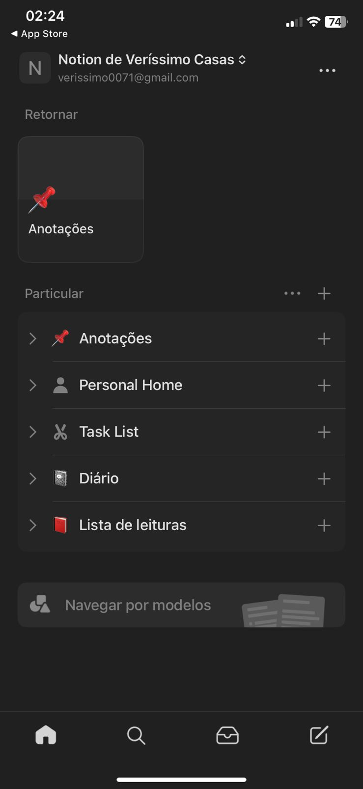
    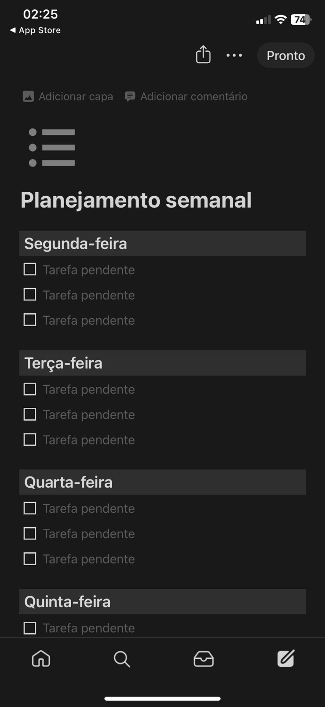
    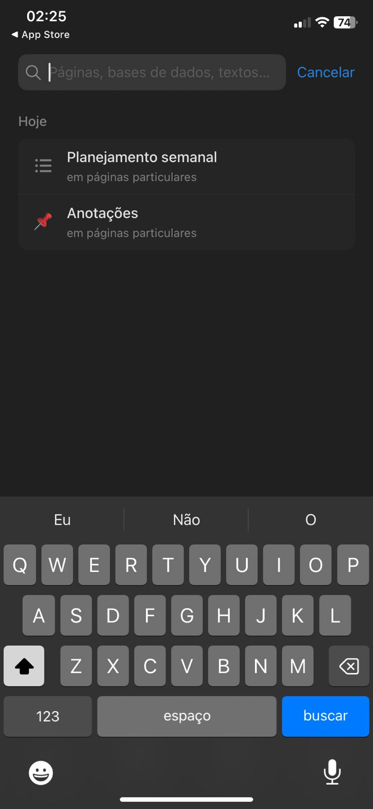

